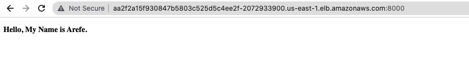

# Cloud DevOps Engineer - Capstone Project

## Project Overview
### Project Description

Develop a CI/CD pipeline for microservice application with blue/green deployment. Start with a linting check, push the built Docker conatiner(s) to the Docker repositiry, and then deploy these Docker container(s) to a small Kubernetes cluster.

### Project Procedure

- Lauch a EC2 instance
  - AMI: Ubuntu Server 18.04 LTS

- Install required dependencies
  - Jenkins
  - Docker
  - pip
  - AWS CLI
  - eksctl
  - kubectl
  - lint

- Install required plugins in Jenkins
  - Blue Ocean
  - Pipeline AWS steps
  - Kubernetes
  
- Build pipeline
  - Docker containers
  - Kubernetes cluster


The Kubernets cluster is launched from the Ubuntu terminal using the command:

```
        eksctl create cluster --name capstoneproject --version 1.21 --nodegroup-name standard-workers --node-type t2.micro \ --nodes 2 --nodes-min 1 --nodes-max 3 --region us-east-1 --managed
```

<br>

<br>

A Makefile is included to install the necessary softwares for the Linux machine within the repo. 

### Project Results
1. Test Dockerfile lint failure in Jenkins pipeline


2. Jenkins pipeline after lint correction finishing deployment


3. AWS EC2 insatnces after finishing deployment


4. AWS EKS cluster


This EKS Cluster ARN and Cluster name needs to be included in the Jenkisnfile for Kubernetes configuration setup


5. AWS CloudFormation stacks


6. Web page



The URL for the ELB: [http://aa2f2a15f930847b5803c525d5c4ee2f-2072933900.us-east-1.elb.amazonaws.com:8000/]


